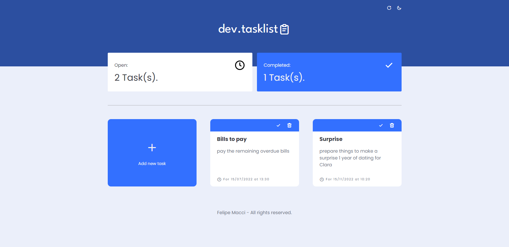

<h1 align="center">DEV.TASKLIST 📜</h1>
<h3 align="center">CREATE AN ORGANIZED TASK LIST</h3>

 

    

 

#### RELEASE NOTES: V1.0.0:
- First version of the project 🎉
- Add tasks and their deadlines
- Erase them whenever you want
- Mark them as complete
- Store them in local storage
- Change the theme to night
- Adaptable to any type of screen

 

#### TECHNOLOGIES:
- HTML 📄
- CSS 🎨
- JAVASCRIPT 💻

 

<h5 align="center">Felipe Macci</h5>